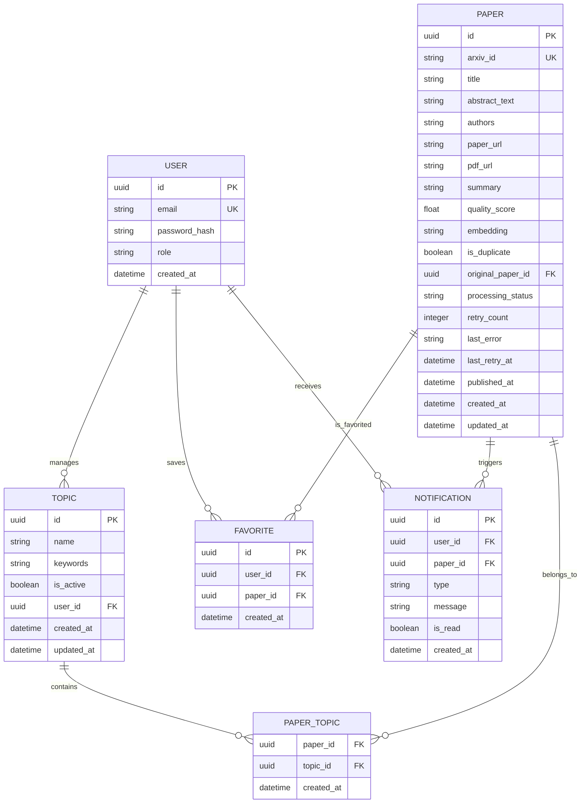

# Thiết kế CSDL (ERD) - Paper Tracker

## 1. Mục tiêu thiết kế
Thiết kế CSDL phục vụ hệ thống theo dõi, xử lý, tóm tắt và gợi ý paper khoa học từ arXiv theo topic do từng user quản lý.

Các nguyên tắc chính:
- Tất cả thực thể chính dùng `UUID` làm khóa chính (UUID v4 trong phạm vi đồ án; khuyến nghị nâng lên UUID v7 khi production để giảm index fragmentation).
- Cột `embedding` dùng kiểu `vector(384)` của `pgvector`, tương ứng model `BAAI/bge-small-en-v1.5` (384 dims, feature-extraction). Dimension được cố định ở tầng schema; mọi thay đổi model đều yêu cầu migration toàn bộ dữ liệu embedding.
- Thiết kế ưu tiên tính nhất quán với pipeline xử lý nền và các use case đã mô tả.
- Mọi dữ liệu nghiệp vụ của người dùng phải được cô lập theo `user_id`.
- `PAPER_TOPIC` là bảng liên kết nhiều-nhiều dùng khóa chính tổng hợp, không tạo `id` riêng.

Phạm vi và giới hạn:
- Không xử lý lock account, forgot password, hoặc 2FA; authentication dừng ở mức email/password + JWT.
- JWT access token có TTL 24 giờ. Không dùng refresh token trong phạm vi đồ án; logout phía client xóa token khỏi storage.
- User không có chức năng retry thủ công cho AI; mọi retry do Retry Scheduler quản lý.
- Xóa `TOPIC` là hard delete. Khi xóa TOPIC, các bản ghi `PAPER_TOPIC` liên quan sẽ bị xóa cascade (`ON DELETE CASCADE`). Dữ liệu `PAPER` không bị xóa.
- Giới hạn đồ án: tối đa 10 topic/user, 5 keyword/topic. Ràng buộc này được kiểm soát ở tầng service (không phải DB trigger).

---

## 2. ERD



> **Ghi chú kiểu dữ liệu:**
> - `PAPER.abstract_text`: tên hiển thị trong diagram để tránh lỗi Mermaid parser. **Tên cột thực tế trong PostgreSQL là `abstract` (TEXT).** Toàn bộ SQL, JPA entity, và migration đều dùng `abstract`.
> - `PAPER.embedding`: kiểu thực tế trong PostgreSQL là `vector(384)` (pgvector). Hiển thị là `string` trong Mermaid do giới hạn cú pháp.
> - `PAPER.original_paper_id`: FK tự tham chiếu tới `PAPER.id` (`ON DELETE SET NULL`). Quan hệ self-referential được bỏ khỏi diagram để tránh lỗi Mermaid, nhưng FK vẫn tồn tại đầy đủ trong schema.
> - `PAPER.last_retry_at`: timestamp lần Retry Scheduler xử lý gần nhất. `NULL` nếu chưa từng retry. Dùng cho admin diagnostic (UC17).
> - `PAPER_TOPIC.topic_id`: FK tới `TOPIC.id` với `ON DELETE CASCADE`.
> - `USER.role`: VARCHAR(10), giá trị hợp lệ: `USER` | `ADMIN`. Default: `USER`.
> - `NOTIFICATION.type`: chỉ có giá trị `NEW_PAPER`. Recommendation là UI-only.

---

## 3. Chi tiết ràng buộc và khóa

### 3.1. Khóa chính (Primary Key)
| Bảng | PK |
|---|---|
| USER | `id` (UUID) |
| TOPIC | `id` (UUID) |
| PAPER | `id` (UUID) |
| PAPER_TOPIC | Composite `(paper_id, topic_id)` |
| FAVORITE | `id` (UUID) |
| NOTIFICATION | `id` (UUID) |

### 3.2. Unique Constraints
| Bảng | Unique Constraint | Mục đích |
|---|---|---|
| USER | `email` | Mỗi email chỉ được đăng ký một lần |
| TOPIC | `(user_id, name)` | Không cho phép hai topic trùng tên trong cùng một user |
| PAPER | `arxiv_id` | Tránh lưu trùng paper từ arXiv |
| FAVORITE | `(user_id, paper_id)` | Mỗi user chỉ lưu favorite một paper một lần |
| PAPER_TOPIC | `(paper_id, topic_id)` — là PK tổng hợp | Tránh gán trùng paper vào cùng topic |
| NOTIFICATION | `(user_id, paper_id, type)` | Mỗi user nhận tối đa một `NEW_PAPER` notification cho mỗi paper |

### 3.3. Foreign Key Constraints
| Bảng | Cột | Tham chiếu | On Delete |
|---|---|---|---|
| TOPIC | `user_id` | `USER.id` | CASCADE |
| PAPER | `original_paper_id` | `PAPER.id` (self-ref) | SET NULL |
| PAPER_TOPIC | `paper_id` | `PAPER.id` | CASCADE |
| PAPER_TOPIC | `topic_id` | `TOPIC.id` | CASCADE |
| FAVORITE | `user_id` | `USER.id` | CASCADE |
| FAVORITE | `paper_id` | `PAPER.id` | CASCADE |
| NOTIFICATION | `user_id` | `USER.id` | CASCADE |
| NOTIFICATION | `paper_id` | `PAPER.id` | CASCADE |

### 3.4. Check Constraints
| Bảng | Constraint | Ghi chú |
|---|---|---|
| USER | `role IN ('USER', 'ADMIN')` | |
| PAPER | `processing_status IN ('PENDING', 'DONE', 'FAILED')` | |
| PAPER | `quality_score IS NULL OR (quality_score >= 0.0 AND quality_score <= 10.0)` | NULL cho phép vì PENDING và DONE-duplicate không có score |
| NOTIFICATION | `type IN ('NEW_PAPER')` | |

---

## 4. Index

### Index thường (B-tree)
| Bảng | Cột | Loại | Ghi chú |
|---|---|---|---|
| USER | `email` | UNIQUE B-tree | Login lookup |
| PAPER | `arxiv_id` | UNIQUE B-tree | Kiểm tra trùng khi fetch |
| PAPER | `published_at` | B-tree | Sort và filter theo ngày |
| PAPER | `processing_status` | B-tree | Retry Scheduler query |
| PAPER | `is_duplicate` | B-tree | Filter cho recommendation |
| PAPER | `original_paper_id` | B-tree | Tra cứu paper gốc |
| PAPER_TOPIC | `topic_id` | B-tree | Join từ topic sang paper |
| PAPER_TOPIC | `paper_id` | B-tree | Join từ paper sang topic |
| PAPER_TOPIC | `(topic_id, paper_id)` | B-tree composite | Tối ưu UC15 stats join pattern |
| TOPIC | `(user_id, is_active)` | B-tree composite | Scheduler load active topics |
| TOPIC | `(user_id, name)` | UNIQUE B-tree | Enforce topic name uniqueness per user |
| NOTIFICATION | `(user_id, is_read, created_at)` | B-tree composite | Notification list query |

> **Lưu ý `FAVORITE`:** Không khai báo B-tree index riêng cho `(user_id, paper_id)` — PostgreSQL tự tạo index khi tạo UNIQUE constraint. Khai báo thêm sẽ tạo 2 index vật lý trùng nhau.

### Index vector (HNSW) — Bắt buộc từ Day 1
```sql
-- Ghi chú toán học: <=> trả về cosine DISTANCE (0–1), không phải similarity.
-- Distance = 1 − Similarity. Ví dụ: similarity 0.95 → distance 0.05.
-- ef_search được cấu hình global qua HikariCP connection-init-sql (xem application.yml)
-- không cần SET LOCAL trong từng query.
CREATE INDEX idx_paper_embedding_hnsw
    ON paper
    USING hnsw (embedding vector_cosine_ops)
    WITH (m = 16, ef_construction = 64);
```
> **Lý do Day-1:** Không có index này, mọi truy vấn duplicate detection và recommendation đều là full-table scan O(n). Ngay cả ở 1.000 paper điều này gây timeout.

### Index full-text (GIN tsvector) — HAI index riêng biệt
**Quan trọng:** UC05 và UC12 dùng expression khác nhau — phải tạo 2 index để mỗi query match đúng index của mình. PostgreSQL chỉ sử dụng functional index khi expression trong query khớp **hoàn toàn** với expression trong index.

```sql
-- Index 1: UC05 Full-text Search — bao gồm authors để hỗ trợ tìm theo tên tác giả
CREATE INDEX idx_paper_fts_search
    ON paper
    USING gin (
        to_tsvector('english',
            coalesce(title, '') || ' ' ||
            coalesce(abstract, '') || ' ' ||
            coalesce(authors, '')
        )
    );

-- Index 2: UC12 Topic Matching — chỉ title + abstract, không có authors
-- (keyword topic là chủ đề nghiên cứu, không phải tên người)
CREATE INDEX idx_paper_fts_topic
    ON paper
    USING gin (
        to_tsvector('english',
            coalesce(title, '') || ' ' ||
            coalesce(abstract, '')
        )
    );
```
> ⚠️ **Lý do tách 2 index:** UC12 query expression là `to_tsvector(title || abstract)`. Nếu chỉ có 1 index trên `to_tsvector(title || abstract || authors)`, expression không khớp → PostgreSQL bỏ qua index → sequential scan toàn bảng mỗi lần pipeline chạy.
>
> UC05 dùng `plainto_tsquery` (AND logic, linh hoạt). UC12 dùng `phraseto_tsquery` (exact phrase). Cả hai đều tương thích với GIN tsvector index tương ứng.

---

## 5. Enum chuẩn hóa
| Enum | Giá trị hợp lệ | Áp dụng cho |
|---|---|---|
| `user.role` | `USER`, `ADMIN` | USER.role |
| `processing_status` | `PENDING`, `DONE`, `FAILED` | PAPER.processing_status |
| `notification.type` | `NEW_PAPER` | NOTIFICATION.type — recommendation là UI-only |

---

## 6. Quy ước trạng thái dữ liệu paper
| Trạng thái | is_duplicate | Điều kiện bắt buộc |
|---|---|---|
| `PENDING` | false | Có thể chưa có `embedding`, `summary`, `quality_score` |
| `DONE` | false | Phải có `embedding`. Nên có `summary`, `quality_score` |
| `DONE` | true | Phải có `embedding`, `original_paper_id`. `summary`, `quality_score` có thể null |
| `FAILED` | false | Có thể thiếu `summary`, `quality_score`. Nên có `last_error` và `last_retry_at` |

---

## 7. Quy ước trường `keywords` trong TOPIC
- Định dạng chuẩn: chuỗi phân cách bằng dấu phẩy, mỗi keyword được trim whitespace, viết thường.
- Ví dụ hợp lệ: `"large language model,rag,vector database"`
- Tối đa 5 keyword mỗi topic (kiểm soát tại tầng service/DTO).
- Tổng độ dài tối đa: 255 ký tự (VARCHAR(255)).

---

## 8. Kế hoạch Flyway Migration

```
V1__enable_extensions.sql       -- BẮT BUỘC CHẠY TRƯỚC
V2__create_tables.sql           -- Tạo tất cả bảng
V3__create_constraints.sql      -- Unique + FK + Check constraints
V4__create_indexes.sql          -- B-tree, HNSW, GIN indexes
V5__seed_admin.sql              -- Bootstrap ADMIN user
```

### V1__enable_extensions.sql
```sql
CREATE EXTENSION IF NOT EXISTS vector;
-- CREATE EXTENSION IF NOT EXISTS pg_trgm; -- tuỳ chọn nếu cần ILIKE
```
> ⚠️ V1 PHẢI chạy trước V2. Nếu không, `vector(384)` columns trong V2 sẽ fail.

### V2__create_tables.sql (guard + snippet PAPER)
```sql
-- Guard: kiểm tra pgvector trước khi tạo bảng
DO $$ BEGIN
  IF NOT EXISTS (SELECT FROM pg_extension WHERE extname = 'vector') THEN
    RAISE EXCEPTION 'pgvector extension not installed. Run V1__enable_extensions.sql first.';
  END IF;
END $$;

-- Snippet bảng PAPER (các bảng khác tương tự)
CREATE TABLE paper (
    id                 UUID PRIMARY KEY DEFAULT gen_random_uuid(),
    arxiv_id           VARCHAR(50)  NOT NULL,
    title              TEXT         NOT NULL,
    abstract           TEXT,
    authors            TEXT,
    paper_url          VARCHAR(500),
    pdf_url            VARCHAR(500),
    summary            TEXT,
    quality_score      FLOAT,
    embedding          vector(384),
    is_duplicate       BOOLEAN      NOT NULL DEFAULT FALSE,
    original_paper_id  UUID,
    processing_status  VARCHAR(10)  NOT NULL DEFAULT 'PENDING',
    retry_count        INTEGER      NOT NULL DEFAULT 0,
    last_error         TEXT,
    last_retry_at      TIMESTAMP WITH TIME ZONE,
    published_at       TIMESTAMP WITH TIME ZONE,
    created_at         TIMESTAMP WITH TIME ZONE NOT NULL DEFAULT NOW(),
    updated_at         TIMESTAMP WITH TIME ZONE NOT NULL DEFAULT NOW()
);
```

### V3__create_constraints.sql
```sql
-- Unique constraints
ALTER TABLE paper        ADD CONSTRAINT uq_paper_arxiv_id    UNIQUE (arxiv_id);
ALTER TABLE topic        ADD CONSTRAINT uq_topic_user_name   UNIQUE (user_id, name);
ALTER TABLE favorite     ADD CONSTRAINT uq_favorite          UNIQUE (user_id, paper_id);
ALTER TABLE notification ADD CONSTRAINT uq_notification      UNIQUE (user_id, paper_id, type);

-- Foreign keys
ALTER TABLE paper        ADD CONSTRAINT fk_paper_original
    FOREIGN KEY (original_paper_id) REFERENCES paper(id) ON DELETE SET NULL;
ALTER TABLE paper_topic  ADD CONSTRAINT fk_pt_topic
    FOREIGN KEY (topic_id) REFERENCES topic(id) ON DELETE CASCADE;

-- Check constraints
ALTER TABLE paper ADD CONSTRAINT chk_processing_status
    CHECK (processing_status IN ('PENDING', 'DONE', 'FAILED'));
ALTER TABLE paper ADD CONSTRAINT chk_quality_score
    CHECK (quality_score IS NULL OR (quality_score >= 0.0 AND quality_score <= 10.0));
ALTER TABLE "user" ADD CONSTRAINT chk_user_role
    CHECK (role IN ('USER', 'ADMIN'));
ALTER TABLE notification ADD CONSTRAINT chk_notification_type
    CHECK (type IN ('NEW_PAPER'));
```

### V4__create_indexes.sql
```sql
-- HNSW vector index
CREATE INDEX idx_paper_embedding_hnsw
    ON paper USING hnsw (embedding vector_cosine_ops)
    WITH (m = 16, ef_construction = 64);

-- GIN full-text index cho UC05 Search (title + abstract + authors)
CREATE INDEX idx_paper_fts_search
    ON paper USING gin (
        to_tsvector('english',
            coalesce(title,'') || ' ' || coalesce(abstract,'') || ' ' || coalesce(authors,'')
        )
    );

-- GIN full-text index cho UC12 Topic Matching (title + abstract only)
CREATE INDEX idx_paper_fts_topic
    ON paper USING gin (
        to_tsvector('english',
            coalesce(title,'') || ' ' || coalesce(abstract,'')
        )
    );

-- B-tree indexes
CREATE INDEX idx_paper_published_at      ON paper(published_at);
CREATE INDEX idx_paper_status            ON paper(processing_status);
CREATE INDEX idx_paper_is_duplicate      ON paper(is_duplicate);
CREATE INDEX idx_paper_original          ON paper(original_paper_id);
CREATE INDEX idx_pt_topic_id             ON paper_topic(topic_id);
CREATE INDEX idx_pt_paper_id             ON paper_topic(paper_id);
CREATE INDEX idx_pt_stats                ON paper_topic(topic_id, paper_id);
CREATE INDEX idx_topic_user_active       ON topic(user_id, is_active);
CREATE INDEX idx_notification_user_read  ON notification(user_id, is_read, created_at);
```

### V5__seed_admin.sql
```sql
-- Bootstrap ADMIN user cho hệ thống
-- Password mặc định: admin123 (BCrypt hash, đổi sau khi deploy)
-- Tạo hash bằng: new BCryptPasswordEncoder().encode("admin123")
INSERT INTO "user" (id, email, password_hash, role, created_at)
VALUES (
    gen_random_uuid(),
    'admin@papertracker.local',
    '$2a$10$N9qo8uLOickgx2ZMRZoMyeIjZAgcfl7p92ldGxad68LJZdL17lh7S',
    'ADMIN',
    NOW()
) ON CONFLICT (email) DO NOTHING;
```
> ⚠️ Hash trên tương ứng password `admin123`. **Bắt buộc đổi password ngay sau khi deploy lần đầu.** Để generate hash mới: `new BCryptPasswordEncoder(10).encode("your_password")`.