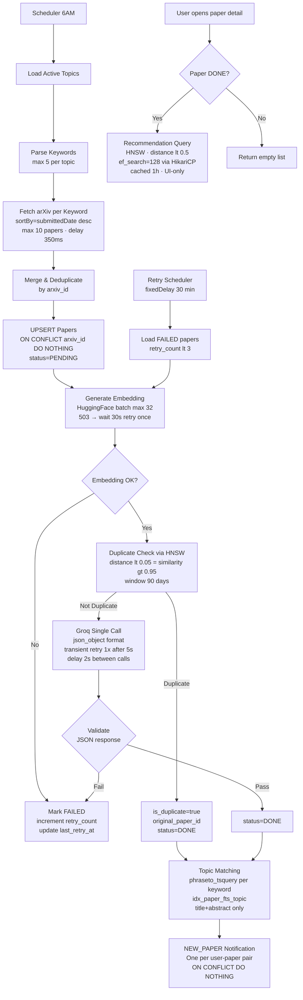

# Đặc tả Use Case - Hệ thống Paper Tracker

## 1. Actor
- **User**: thực hiện chức năng nghiệp vụ qua giao diện web.
- **Scheduler**: pipeline nền lúc 6h sáng.
- **Retry Scheduler**: xử lý lại paper lỗi mỗi 30 phút.

Phạm vi: JWT HMAC-SHA256 TTL 24h (jjwt 0.12.6). Không retry thủ công. Logout phía client.

---

## 2. Quy tắc hệ thống chung
- `user_id` lấy từ JWT, không nhận từ client.
- `PAPER.processing_status` ∈ {`PENDING`, `DONE`, `FAILED`}.
- `NOTIFICATION.type` ∈ {`NEW_PAPER`}. Recommendation là UI-only.
- `USER.role` ∈ {`USER`, `ADMIN`}. ADMIN bootstrap qua V5__seed_admin.sql.
- Giới hạn: max 10 topic/user, 5 keyword/topic, 10 paper/keyword.
- API list trả `PagedResponse<T>`:
```json
  { "content": [...], "page": 0, "size": 10, "totalElements": 100, "totalPages": 10, "last": false }
```
- **API danh sách paper mặc định chỉ trả `processing_status = 'DONE'`.**
- Mọi insert NOTIFICATION dùng `ON CONFLICT (user_id, paper_id, type) DO NOTHING`.

---

## 3. Use Cases chính

### UC01: Đăng ký
1. User nhập `email`, `password`.
2. Kiểm tra trùng email.
3. Băm BCrypt. Tạo USER: `id` UUID, `role = USER`.

**Ngoại lệ:** Email tồn tại → 409. Input không hợp lệ → 400.
**Giới hạn:** Không có forgot password, lock, 2FA.

---

### UC02: Đăng nhập
1. Tìm USER theo email. Verify BCrypt.
2. Sinh JWT HMAC-SHA256 chứa `user_id` + `role`, TTL 24h.

**Ngoại lệ:** Sai thông tin → 401.

---

### UC03: Quản lý Topic

*Thêm:* Kiểm tra max 10/user → 409. Kiểm tra trùng name → 409. Tạo `is_active = true`.

*Sửa:* Verify ownership. Kiểm tra uniqueness nếu sửa name. Cập nhật `updated_at`.

*Xóa:* Verify ownership. Hard delete. PAPER_TOPIC bị xóa cascade. PAPER không bị xóa.

**Ngoại lệ:** 404, 403, 409.

---

### UC04: Xem danh sách Paper
1. Nhận `page`, `size`, `keyword`, `topicId`, `isFavorite`.
2. **Chỉ trả `processing_status = 'DONE'`.**
3. Trả `PagedResponse<PaperSummaryDto>`, sort `published_at desc`.

**Ngoại lệ:** Topic filter không thuộc user → 403.
**DTO:** không trả `embedding`, `last_error`, `retry_count`.

---

### UC05: Tìm kiếm Paper
Query dùng `plainto_tsquery` + `idx_paper_fts_search` (title + abstract + authors):
```sql
WHERE to_tsvector('english', coalesce(title,'') || ' ' || coalesce(abstract,'') || ' ' || coalesce(authors,''))
    @@ plainto_tsquery('english', :keyword)
AND processing_status = 'DONE'
```
Trả `PagedResponse<PaperSummaryDto>`. Keyword rỗng → toàn bộ DONE papers.

---

### UC06: Xem chi tiết Paper
1. Lấy paper theo id (không giới hạn processing_status).
2. Trả chi tiết (không có `embedding`).
3. Nếu `DONE` và có embedding → gọi UC14 đính kèm recommendation.

**Ngoại lệ:** 404. Status != DONE → trả bình thường, không có recommendation.

---

### UC07: Lưu yêu thích

*Lưu:* Tạo `FAVORITE(user_id, paper_id)`. Đã tồn tại → idempotent (200 OK).

*Bỏ lưu:* `DELETE /papers/{paperId}/favorite` — frontend gửi `paperId`, backend derive `user_id` từ JWT, xóa bằng `WHERE user_id = :userId AND paper_id = :paperId`. Không cần biết `favoriteId`.

**Ngoại lệ:** Paper không tồn tại → 404.

---

### UC08: Xem và Quản lý Notification

*Xem:* Nhận `page`, `size`, `isRead`. Trả `PagedResponse<NotificationDto>`, sort `created_at desc`.

*Đánh dấu một:* Verify ownership. Cập nhật `is_read = true`.

*Đánh dấu tất cả (UC08b):*
```sql
UPDATE notification SET is_read = true WHERE user_id = :userId AND is_read = false
```
Trả số lượng đã cập nhật.

**Ngoại lệ:** Không thuộc user → 403. Không tồn tại → 404.

---

### UC09: Xem danh sách Paper yêu thích
Query `FAVORITE` join `PAPER`. Trả `PagedResponse<PaperSummaryDto>`, sort `FAVORITE.created_at desc`.

---

## 4. Use Case hệ thống (Background)

### UC10: Fetch Paper theo topic keyword
1. `@Scheduled(cron = "0 0 6 * * *")`.
2. Query `TOPIC` có `is_active = true`.
3. Tách keywords (max 5, comma-split, trim).
4. Gọi arXiv API: **URL bắt buộc thêm `sortBy=submittedDate&sortOrder=descending`** để lấy paper mới nhất (mặc định arXiv sort theo relevance, không theo ngày). Max `max-results-per-keyword` papers. Delay 350ms.
5. Timeout 30s. Lỗi tạm thời: retry exponential backoff max 2 lần. Lỗi vĩnh viễn: bỏ keyword, log.
6. Hợp nhất, khử trùng theo `arxiv_id`.
7. `INSERT INTO paper … ON CONFLICT (arxiv_id) DO NOTHING`. Paper mới: `PENDING`, `retry_count = 0`.

**Ngoại lệ:** Không có topic active → kết thúc sớm, ghi log.

---

### UC11: AI Processing Pipeline
1. Lấy paper `PENDING`.
2. HuggingFace embedding batch max 32. HTTP 503 → chờ 30s, retry 1 lần.
3. Duplicate check: `embedding <=> candidate < 0.05` (similarity > 0.95) qua HNSW. Window: 90 days.
4. Duplicate → `is_duplicate = true`, `original_paper_id`, `DONE`.
5. Không duplicate:
   - Groq single call với `response_format: json_object`. Delay 2s.
   - **Transient retry:** HTTP 5xx hoặc timeout → retry 1 lần sau 5 giây. HTTP 429 → không retry tại đây (Retry Scheduler sẽ xử lý sau 30 phút).
   - **Validate response:** `quality_score ∈ [0.0, 10.0]`, `summary` không rỗng ≤ 2000 ký tự. Fail → `FAILED`, set `last_error`.
   - Pass → `DONE`.
6. Cập nhật `updated_at`.

> **Transaction:** mỗi paper trong `@Transactional(propagation = REQUIRES_NEW)`. Outer method KHÔNG có `@Transactional`.

**Ngoại lệ:** Lỗi AI sau retry → `FAILED`, tăng `retry_count`, set `last_error`.

---

### UC12: Topic Matching
Query dùng `phraseto_tsquery` + **`idx_paper_fts_topic`** (title + abstract only):
```sql
SELECT 1 FROM paper
WHERE id = :paperId
  AND to_tsvector('english', coalesce(title,'') || ' ' || coalesce(abstract,''))
      @@ phraseto_tsquery('english', :keyword)
```

Java `anyMatch` trên danh sách keywords. Match → `INSERT INTO paper_topic … ON CONFLICT DO NOTHING`.

> **Lý do `phraseto_tsquery`:** keyword topic là cụm chuyên ngành cần match theo thứ tự. `plainto_tsquery` gây false positive.
>
> **Lý do expression không include `authors`:** phải khớp hoàn toàn với `idx_paper_fts_topic`. Nếu include `authors`, query sẽ không dùng được index → sequential scan.
>
> **Lý do không match `authors`:** keyword topic là chủ đề nghiên cứu, không phải tên người.

---

### UC13: Notification Creation
**Scope:** Chỉ tạo `NEW_PAPER`. Recommendation là UI-only, không ghi DB.

1. Lấy topics paper match (từ UC12).
2. Xác định owner (TOPIC.user_id). Deduplicate users: mỗi user lấy topic match đầu tiên.
3. Tạo: `type = NEW_PAPER`, `message = "New paper matched your topic '{topicName}': {title}"`, `is_read = false`.
4. `INSERT … ON CONFLICT (user_id, paper_id, type) DO NOTHING`.

---

### UC14: Recommendation
**Thiết kế:** UI-only — API response, không ghi NOTIFICATION.

1. Paper `DONE` với embedding.
2. Kiểm tra Caffeine cache (key = `paper_id`, TTL = 1h).
3. Cache miss: query HNSW index. `ef_search = 128` đã được set global qua HikariCP `connection-init-sql` — **không cần `SET LOCAL` trong query**:
```sql
   SELECT * FROM paper
   WHERE processing_status = 'DONE'
     AND is_duplicate = false
     AND id <> :paperId
     AND published_at >= NOW() - INTERVAL '1 year'
     AND embedding <=> CAST(:embedding AS vector) < 0.5
   ORDER BY embedding <=> CAST(:embedding AS vector)
   LIMIT 10
```
4. Cache kết quả. Trả top-10 trong response body.

**Ngoại lệ:** Status != DONE hoặc không có embedding → danh sách rỗng. Không có paper nào distance < 0.5 → danh sách rỗng.

---

### UC15: Xem thống kê xu hướng
```sql
SELECT to_char(p.published_at, 'YYYY-MM') AS year_month, COUNT(*) AS paper_count
FROM paper_topic pt
JOIN paper p ON p.id = pt.paper_id
WHERE pt.topic_id = :topicId
  AND p.published_at >= NOW() - INTERVAL '2 years'
GROUP BY to_char(p.published_at, 'YYYY-MM')
ORDER BY year_month;
```
Dùng index `idx_pt_stats (topic_id, paper_id)` + `idx_paper_published_at`.

**Ngoại lệ:** 404, 403. Không có dữ liệu → danh sách rỗng.

---

### UC16: Retry AI Processing
1. `@Scheduled(fixedDelay = 1800000)`.
2. Query: `FAILED AND retry_count < 3`.
3. Thực hiện lại UC11 (embedding → duplicate → Groq + validation).
4. Cập nhật `last_retry_at = NOW()`.
5. Thành công → `DONE` → UC12 → UC13.
6. Thất bại → tăng `retry_count`, set `last_error`.
7. `retry_count >= 3` → giữ FAILED. Admin reset qua UC17.

---

### UC17: Admin — Quản lý Paper lỗi
**Yêu cầu:** `role = ADMIN`.

- `GET /admin/papers?status=FAILED` — trả `PagedResponse` với `arxiv_id`, `retry_count`, `last_retry_at`, `last_error`.
- `POST /admin/papers/{id}/reset-retry` — set `retry_count = 0`, `processing_status = PENDING`, `last_error = null`.

**Ngoại lệ:** Không phải ADMIN → 403. Paper không tồn tại → 404.

---

## 5. System Flow

